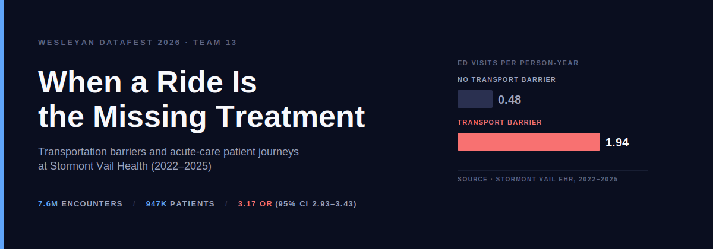
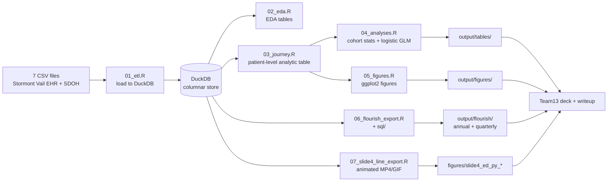

<picture>
  <source media="(prefers-color-scheme: dark)"  srcset="assets/banner-dark.svg"  type="image/svg+xml">
  <source media="(prefers-color-scheme: light)" srcset="assets/banner-light.svg" type="image/svg+xml">
  <source media="(prefers-color-scheme: dark)"  srcset="assets/banner-dark.png">
  <source media="(prefers-color-scheme: light)" srcset="assets/banner-light.png">
  
</picture>

[](https://github.com/Builder106/datafest-2026/actions/workflows/ci.yml)
[](https://www.r-project.org/)
[](https://duckdb.org/)
[](#license)
[](https://datafest-2026.vercel.app/)
[](https://ww2.amstat.org/education/datafest/)

> A single question — *"Has lack of transportation kept you from medical appointments?"* — identifies a cohort with **~3× odds** of acute-care need, independent of age. This repo is the reproducible R + DuckDB pipeline behind that finding.

## What this is

Team 13's submission to **[ASA DataFest 2026](https://ww2.amstat.org/education/datafest/)** at **Wesleyan University** (April 17–19, 2026). The data sponsor was **Stormont Vail Health**, which released a longitudinal EHR sample joined to a 12-domain social-determinants questionnaire.

We asked: *Do patients who report a transportation barrier experience measurably different healthcare journeys than otherwise similar patients?* The headline answer is yes, and the gap is large enough that the transport question itself is a screening signal worth acting on.

Full deliverables are in the repo:

- **[Team13_Writeup.pdf](Team13_Writeup.pdf)** — 1-page judges' writeup
- **[Team13_Presentation.pdf](Team13_Presentation.pdf)** — 4-slide deck
- **[analysis/](analysis/)** — R + DuckDB pipeline and reproducibility notes

## Key findings

| Outcome | No barrier | Transport barrier | Effect |
| --- | --- | --- | --- |
| ED visits per person-year | 0.48 | **1.94** | 4.0× crude |
| Inpatient admits per person-year | 0.22 | **0.70** | 3.2× crude |
| Any ED visit (prevalence) | 43% | **68%** | OR **3.17** (95% CI 2.93–3.43) |
| Any inpatient admit (prevalence) | 35% | **63%** | OR **3.49** (3.23–3.77) |

The ED-return gap also persists *inside* every chronic-disease cohort we examined (hypertension 33% vs 15%, type 2 diabetes 40% vs 17%, CKD 37% vs 21%, AFib 34% vs 24% — 180-day ED return after index encounter). Barrier patients are also *younger* (median 51 vs 61), ruling out an age artifact. The logistic model is fit on n = 58,639 screened patients with `outcome ~ transport + age + sex`.

Caveats matter — see the [writeup](Team13_Writeup.pdf) and the [Caveats](#caveats) section below.

## Pipeline



The pipeline is orchestrated by **[run_all.R](analysis/R/run_all.R)** and gated by smoke tests in **[smoke_test_outputs.R](analysis/tests/smoke_test_outputs.R)**.

## Reproducing the analysis

The raw EHR data is **not** in this repo (license restriction). The pipeline is reproducible against any DataFest 2026 CSV bundle dropped into `DataFest 2026 - Data Challenge/Data/2026-ASA-DataFest-Data-Files/`.

```bash
# 1. R packages (one-time, into ~/R/datafest_libs)
Rscript -e 'install.packages(c("data.table","duckdb","DBI","dplyr","tidyr","stringr","lubridate","ggplot2","scales"), lib="~/R/datafest_libs")'

# 2. Drop the CSV bundle into place
# DataFest 2026 - Data Challenge/Data/2026-ASA-DataFest-Data-Files/*.csv

# 3. Run the pipeline (builds ~/.datafest_cache/datafest.duckdb on first run)
Rscript analysis/R/run_all.R

# 4. Smoke-test the outputs
Rscript analysis/tests/smoke_test_outputs.R
```

If the DB already exists, skip ETL: `Rscript analysis/R/run_all.R --skip-etl`.

The shared SQL for Flourish CSV exports lives in **[analysis/sql/](analysis/sql/)** and can be run by the DuckDB CLI directly — see **[analysis/sh/flourish_export_duckdb_cli.sh](analysis/sh/flourish_export_duckdb_cli.sh)**.

Full run-order details: **[analysis/README.md](analysis/README.md)**.

## Caveats

The data is observational and the screening sample is non-random. We surface these explicitly rather than hiding them:

- Only **~6%** of patients in the release (61,052 / 947,685) have any SDOH answer. Absolute prevalences should not be projected to the full system.
- **20%** of encounter rows carry a `PrimaryDiagnosisKey` not found in the diagnosis lookup (a known data issue per the sponsor Q&A) — the chronic-disease cohort is therefore a lower bound.
- **65%** of patients have no parseable FIPS code, so no geographic model was fit.
- `DepartmentType` is `*Unknown` for **71%** of rows, so setting analyses use boolean encounter flags (`IsEdVisit`, `IsInpatientAdmission`, etc.) instead.
- Patient journeys are left- and right-censored at the 2022-01-01 / 2025-12-31 window; rates are annualized by observed follow-up.

## Tech stack

- **R 4.3+** for the analysis pipeline (`data.table`, `duckdb`, `DBI`, `ggplot2`, `scales`)
- **DuckDB** as the local columnar store (~7.6M-row encounter table)
- **Flourish** + **RAWGraphs** for interactive web visualizations (CSV-driven)
- **ffmpeg** for the animated Slide 4 export (MP4/GIF)
- **LaTeX (XeLaTeX)** via pandoc for the 1-page writeup PDF

## Acknowledgments

- **Stormont Vail Health** for the de-identified EHR and SDOH data sponsorship
- **[Wesleyan QAC](https://www.wesleyan.edu/qac/)** for hosting Wesleyan DataFest 2026
- **[American Statistical Association](https://www.amstat.org/)** for the DataFest program

## License

Code in this repository is released under the [MIT License](LICENSE). The underlying EHR and SDOH data are **not** included and remain subject to the data-use agreement with Stormont Vail Health and the ASA DataFest 2026 release terms.
