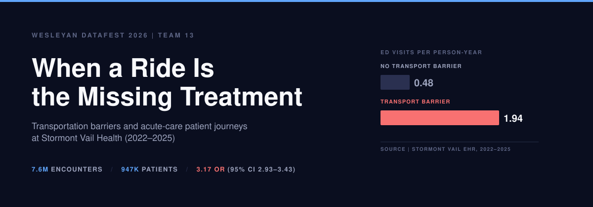
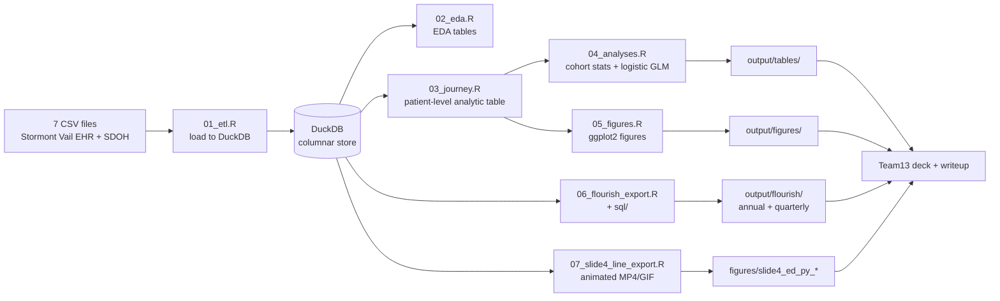

<picture>
  <source media="(prefers-color-scheme: dark)"  srcset="assets/banner-dark.svg"  type="image/svg+xml">
  <source media="(prefers-color-scheme: light)" srcset="assets/banner-light.svg" type="image/svg+xml">
  <source media="(prefers-color-scheme: dark)"  srcset="assets/banner-dark.png">
  <source media="(prefers-color-scheme: light)" srcset="assets/banner-light.png">
  
</picture>

[](https://github.com/Builder106/datafest-2026/actions/workflows/ci.yml)
[](https://www.r-project.org/)
[](https://duckdb.org/)
[](#license)
[](https://datafest-2026.vercel.app/)
[](https://ww2.amstat.org/education/datafest/)

> A single question: *"Has lack of transportation kept you from medical appointments?"* identifies a patient group with **over 3x higher odds** of needing emergency hospital care, regardless of age. This repository contains the reproducible analysis pipeline behind that finding.

## 💡 What is this Project?

When patients cannot get a ride to regular doctor appointments, small health problems can grow into medical emergencies. This project analyzed anonymized hospital records from nearly 1 million patient encounters to study how transportation barriers impact healthcare outcomes.

The finding is striking: patients without reliable transportation visit the emergency room four times more frequently and are admitted to the hospital over three times as often. Providing basic transportation support can keep patients healthier while drastically reducing emergency healthcare costs.

**Live site:** [datafest-2026.vercel.app](https://datafest-2026.vercel.app/)

## What this is

Team 13's project for **[ASA DataFest 2026](https://ww2.amstat.org/education/datafest/)** at **Wesleyan University** (April 17 to 19, 2026). The data sponsor was **Stormont Vail Health**, which provided an anonymized electronic health record sample linked to social needs survey responses.

Full deliverables:

- **[Team13_Writeup.pdf](Team13_Writeup.pdf)**: 1-page summary writeup
- **[Team13_Presentation.pdf](Team13_Presentation.pdf)**: 4-slide presentation deck
- **[analysis/](analysis/)**: Complete R and DuckDB data processing scripts

## Key findings

| Outcome | Patients with reliable rides | Patients with transportation barriers | Effect |
| --- | --- | --- | --- |
| Emergency Room (ED) visits per person per year | 0.48 | **1.94** | 4.0x more visits |
| Hospital inpatient admissions per person per year | 0.22 | **0.70** | 3.2x more hospitalizations |
| Likelihood of visiting the Emergency Room | 43% | **68%** | **3.17x higher odds** (95% CI 2.93 to 3.43) |
| Likelihood of hospital admission | 35% | **63%** | **3.49x higher odds** (95% CI 3.23 to 3.77) |

*What this means:*
- **Emergency Room (ED) visits**: Patients facing ride barriers end up in the emergency room about four times as often.
- **Hospital Inpatient Stays**: Patients who miss routine checkups are more than three times as likely to be admitted to a hospital bed for intensive care.
- **Across chronic conditions**: The gap persists across chronic diseases: hypertension (33% vs 15% return to ED within 180 days), type 2 diabetes (40% vs 17%), kidney disease (37% vs 21%), and irregular heartbeat (34% vs 24%). Patients with transportation barriers are also younger on average (median age 51 vs 61), proving this is not simply an effect of aging.

Caveats matter — see the [writeup](Team13_Writeup.pdf) and the [Caveats](#caveats) section below.

## Pipeline


```mermaid
flowchart LR
  csv["7 CSV files<br/>Stormont Vail EHR + SDOH"] --> etl["01_etl.R<br/>load to DuckDB"]
  etl --> duck[("DuckDB<br/>columnar store")]
  duck --> eda["02_eda.R<br/>EDA tables"]
  duck --> journey["03_journey.R<br/>patient-level analytic table"]
  journey --> analyses["04_analyses.R<br/>cohort stats + logistic GLM"]
  journey --> figures["05_figures.R<br/>ggplot2 figures"]
  duck --> flourish["06_flourish_export.R<br/>+ sql/"]
  duck --> slide4["07_slide4_line_export.R<br/>animated MP4/GIF"]

  analyses --> tables["output/tables/"]
  figures --> figs["output/figures/"]
  flourish --> rawviz["output/flourish/<br/>annual + quarterly"]
  slide4 --> animation["figures/slide4_ed_py_*"]

  tables --> deck["Team13 deck + writeup"]
  figs --> deck
  rawviz --> deck
  animation --> deck
```

The pipeline is orchestrated by **[run_all.R](analysis/R/run_all.R)**and gated by smoke tests in**[smoke_test_outputs.R](analysis/tests/smoke_test_outputs.R)**.

## Reproducing the analysis

The raw EHR data is **not** in this repo (license restriction). The pipeline is reproducible against any DataFest 2026 CSV bundle dropped into `DataFest 2026 - Data Challenge/Data/2026-ASA-DataFest-Data-Files/`.

```bash

# 1. R packages (one-time, into ~/R/datafest_libs)

Rscript -e 'install.packages(c("data.table","duckdb","DBI","dplyr","tidyr","stringr","lubridate","ggplot2","scales"), lib="~/R/datafest_libs")'

# 2. Drop the CSV bundle into place

# DataFest 2026 - Data Challenge/Data/2026-ASA-DataFest-Data-Files/*.csv

# 3. Run the pipeline (builds ~/.datafest_cache/datafest.duckdb on first run)

Rscript analysis/R/run_all.R

# 4. Smoke-test the outputs

Rscript analysis/tests/smoke_test_outputs.R
```

If the DB already exists, skip ETL: `Rscript analysis/R/run_all.R --skip-etl`.

The shared SQL for Flourish CSV exports lives in **[analysis/sql/](analysis/sql/)** and can be run by the DuckDB CLI directly (see **[analysis/sh/flourish_export_duckdb_cli.sh](analysis/sh/flourish_export_duckdb_cli.sh)**).

Full run-order details: **[analysis/README.md](analysis/README.md)**.

## Caveats

The data is observational and the screening sample is non-random. We surface these explicitly rather than hiding them:

- Only **~6%** of patients in the release (61,052 / 947,685) completed social determinants of health survey questions.
- **20%** of encounter rows carry a missing diagnosis key (a known data issue per the sponsor Q&A), meaning chronic disease rates represent a conservative lower bound.
- **65%** of patients have no parseable location code, so geographic models were not fit.
- Patient journeys are tracked within the 2022 to 2025 window; rates are annualized by observed follow-up.

## Tech stack

- **R 4.3+** for data processing and statistical analysis
- **DuckDB** for fast queries across 7.6 million hospital encounter records
- **Flourish & RAWGraphs** for interactive charts
- **ffmpeg** for video exports
- **LaTeX (XeLaTeX)** for the research writeup PDF

## Acknowledgments

- **Stormont Vail Health** for the de-identified healthcare dataset
- **[Wesleyan QAC](https://www.wesleyan.edu/qac/)** for hosting Wesleyan DataFest 2026
- **[American Statistical Association](https://www.amstat.org/)** for the DataFest program

## License

Code in this repository is released under the [MIT License](LICENSE). The underlying EHR and survey data are **not** included and remain subject to the data-use agreement with Stormont Vail Health and the ASA DataFest 2026 release terms.
